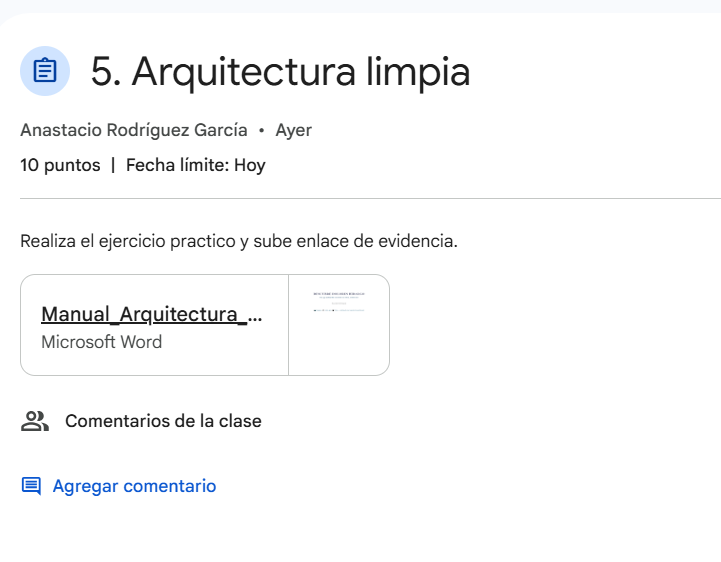
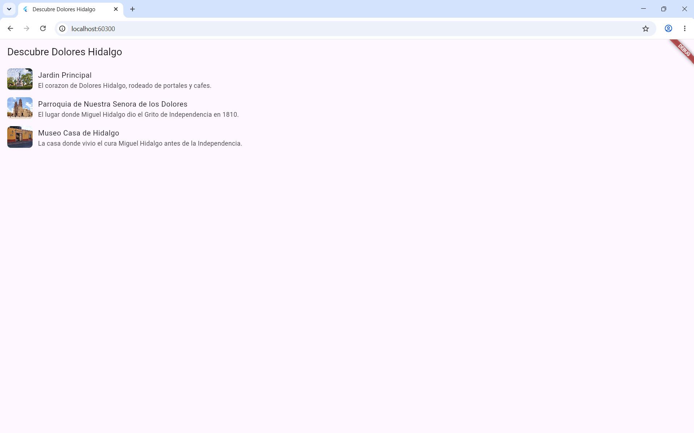
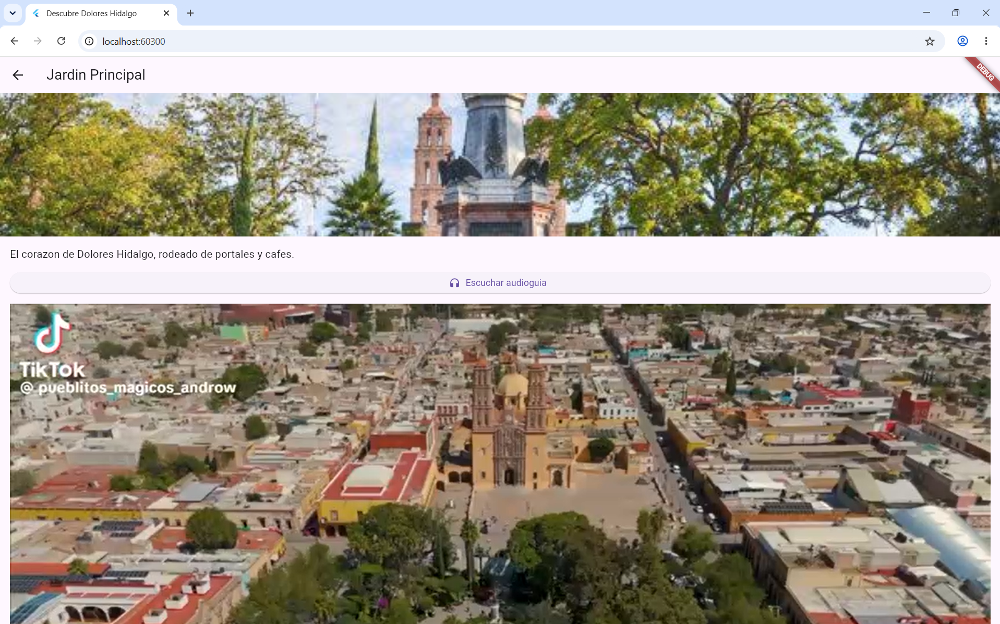
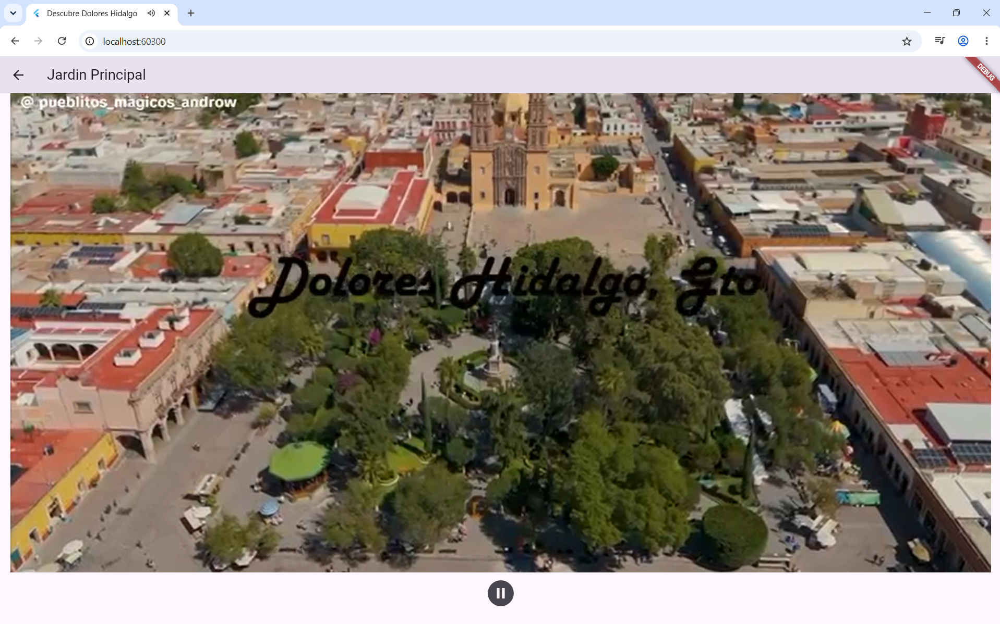
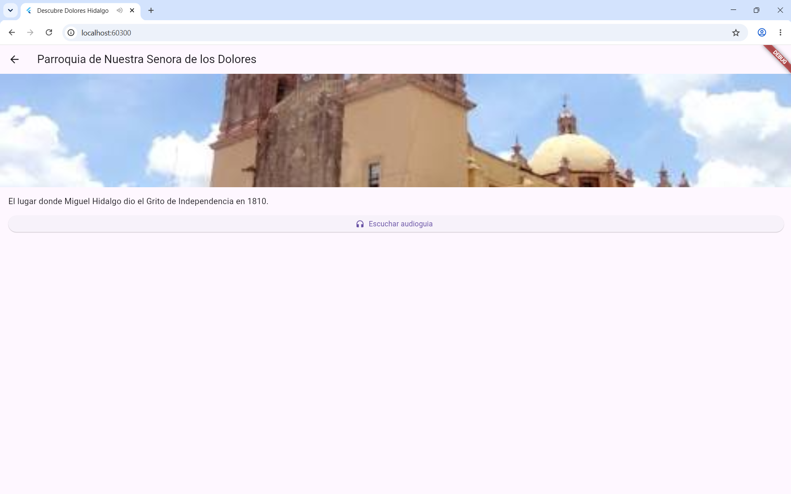
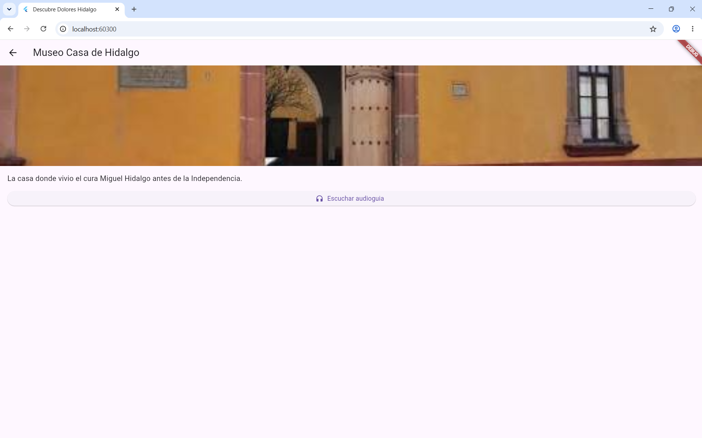

# Descubre Dolores Hidalgo

Guía turística multimedia construida con **Clean Architecture** en Flutter. El usuario ve una lista de lugares emblemáticos de Dolores Hidalgo (Jardín Principal, Parroquia, Museo Casa de Hidalgo) y en cada uno puede ver una fotografía, escuchar una audio-guía narrada y, cuando está disponible, reproducir un video corto del lugar.

Proyecto de la asignatura **Desarrollo Móvil Integral** — actividad "Arquitectura limpia".

## Arquitectura

El código está organizado en 3 capas concéntricas, siguiendo la regla de dependencia (las capas externas dependen del Dominio, nunca al revés):

```
lib/
  domain/            Entidades, casos de uso e interfaces de repositorio.
                      No importa Flutter ni ningún paquete externo.
  data/               Implementación del repositorio y fuente de datos local.
  presentation/       ViewModels (MVVM) y pantallas de Flutter.
  main.dart           Composition root: aquí se conectan las 3 capas.
```

| Capa | Contiene | Depende de |
|---|---|---|
| Dominio | `LugarTuristico`, `LugaresRepository` (interfaz), `ObtenerLugares`, `ObtenerLugarPorId` | De nada |
| Datos | `LugaresLocalDataSource`, `LugaresRepositoryImpl` | Del Dominio |
| Presentación | `LugaresViewModel`, `DetalleViewModel`, `ListaLugaresScreen`, `DetalleLugarScreen` | Del Dominio |

## Capturas de la app funcionando

**Lista de lugares turísticos**



**Detalle del lugar: imagen y audio-guía**



**Reproduciendo el video del lugar**



**Control de reproducción del video**



**Detalle: Parroquia de Nuestra Señora de los Dolores**



**Detalle: Museo Casa de Hidalgo**



## Cómo ejecutar

```bash
flutter pub get
flutter run
```

## Pruebas

El caso de uso `ObtenerLugares` está probado con TDD usando un repositorio Fake, sin depender de Flutter ni de multimedia real:

```bash
flutter test
```

## Checklist de Arquitectura Limpia

- [x] Ningún archivo en `domain/` importa `package:flutter/material.dart`
- [x] Las entidades del Dominio no tienen métodos `fromJson`/`toJson`
- [x] Cada caso de uso representa una sola acción del usuario
- [x] Los ViewModels reciben casos de uso por su constructor
- [x] `main.dart` es el único archivo que conoce las clases concretas de las 3 capas
- [x] Existe una prueba del Dominio usando un Fake
- [x] Los controladores de audio/video se liberan con `dispose()`
